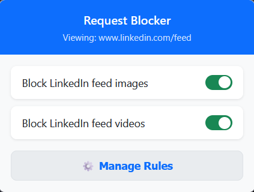
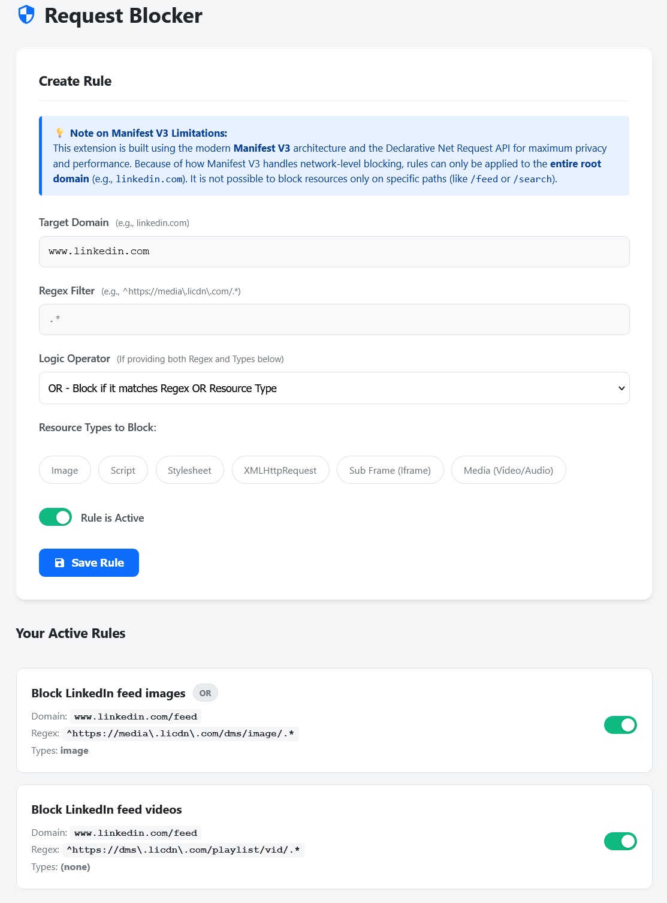

# Request Blocker Extension

This browser extension allows you to block user defined requests.

Many times you may want that specific type of data should not be shown to you.

For example, while surfing LinkedIn, you may only want to focus on content rather than images and videos.

In that case, you can use this extension to block image and video rendering. This extension actually blocks the requests used to fetch the resources from the network, saving your bandwidth and memory while fulfilling your requirement.

---

## How to Use It

### 1. The Quick Menu
When you click the extension's icon next to your browser's address bar, a small menu opens.
* It shows you exactly which website you are currently looking at.
* It displays a list of your rules with an easy **On/Off switch**.
* Click the **⚙️ Manage Rules** button to create or edit your rules.

### 2. Creating Rules (The Dashboard)
When you click "Manage Rules," you will be taken to your full-screen dashboard. Here is how to set up a new rule:

* **Target Website:** Type the web address where you want the rule to apply (for example, type `linkedin.com` to block things *only* on LinkedIn). If you leave this blank, the rule will apply to every website you visit.
* **What to Block:** Check the boxes for the exact things you want to stop loading:
    * **Image:** Pictures and photos.
    * **Media:** Video and audio files.
    * **Script / Stylesheet:** The background code that makes websites interactive or colorful *(Warning: blocking these might make a website look broken, so use with caution!)*.
* **Save Rule:** Click the save button, and your browser will immediately start following your new rule!

(Note: You might notice an "Advanced Regex" field and a "Logic Operator" dropdown. If you don't know what those are, you can safely ignore them!

---

## Feedback & Support
Found a bug or have any suggestion, or anything else you want to tell?

Please send your feedback to: **[yash.m.bhayani@zohomail.in](mailto:yash.m.bhayani@zohomail.in)**

---

## LICENSE

- If you want to fork this repository and add your own better version, you can. I want this code to be used for further enhancement, but it **must not be used for commercial purposes**. Any level of fork of this code must always be free.

- License: [Attribution-NonCommercial-ShareAlike 4.0 International](https://creativecommons.org/licenses/by-nc-sa/4.0/)

