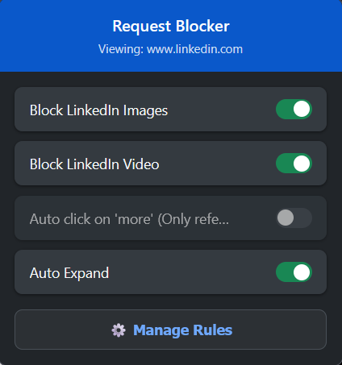
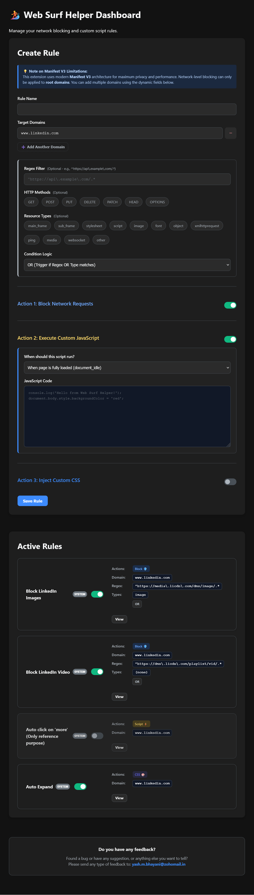

# Web Surf Helper

The helper extension, which helps you while you surf the web.

It allows you to:
1. Block specific network requests
2. Execute custom JavaScript after a specific event (Document idle/start/end, or before a specified network request)
3. Add custom CSS

Many times, you may want specific types of data to remain hidden. For example, while surfing LinkedIn, you may only want to focus on content rather than images and videos.

In that case, you can use this extension to block image and video rendering. This extension actually blocks the requests used to fetch the resources from the network, saving your bandwidth and memory while fulfilling your requirement. Beyond simple blocking, you can now automate page actions or re-style websites entirely.

### 🛠️ Built-in Rules
1. Block LinkedIn Images
2. Block LinkedIn Video
3. LinkedIn auto-click on 'more' *(for reference purposes only)*
4. LinkedIn post auto-expand

Link: https://addons.mozilla.org/en-US/firefox/addon/network-request-blocker/

Video: https://ymbitsolutions.com/videos/browser_extension/request-blocker-browser-extension.mp4

---

## 📖 How to Use It

### 1. The Quick Menu
When you click the extension's icon next to your browser's address bar, a small menu opens.
* It shows you exactly which website you are currently looking at.
* It displays a list of your rules with an easy **On/Off switch**.
* Click the **⚙️ Manage Rules** button to create or edit your rules.

### 2. Creating Rules (The Dashboard)
When you click "Manage Rules," you will be taken to your full-screen dashboard. Here is how to set up a new rule:

* **Target Domains:** Add the web addresses where you want the rule to apply (for example, `example.com`). You can add multiple domains using the dynamic fields. If you leave this blank, It will apply globally.
* **Action 1 - Block Network Requests:** Check the boxes for the exact resource types (like `image`, `media`, `script`, `stylesheet`) or HTTP methods you want to stop from loading.
* **Action 2 - Execute Custom JavaScript:** Write custom code and select when it should run, such as when the page initially loads, when the DOM is ready, when the page is fully loaded, or upon network interception.
* **Action 3 - Inject Custom CSS:** Add CSS code to hide elements or change the layout of the page on load.
* **Save Rule:** Click the save button, and your browser will immediately start following your new rule!

> **Note:** You might notice an "Regex Filter" field and a "Condition Logic" dropdown. If you don't know what those are, you can safely ignore them!

---

## 💬 Feedback & Support
Found a bug, have a suggestion, or anything else you want to share?

Please send your feedback to: **[yash.m.bhayani@zohomail.in](mailto:yash.m.bhayani@zohomail.in)**

---

## LICENSE

* If you want to fork this repository and add your own better version, you can. I want this code to be used for further enhancement, but it **must not be used for commercial purposes**. Any level of fork of this code must always be free.
* **License:** [Attribution-NonCommercial-ShareAlike 4.0 International](https://creativecommons.org/licenses/by-nc-sa/4.0/)